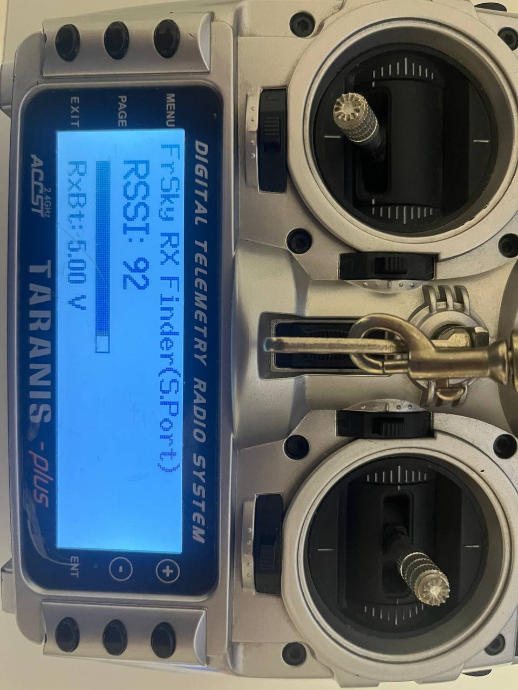
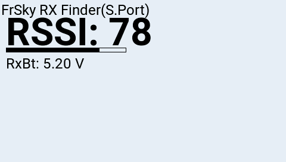

# FrSky RX Finder

*ModelLocator for FrSky S.Port Receivers: TD (S)R\*, S\*R, M\*R, G\*R, X\*R,TW R\*, ADV sensors such as X8R, X4R, X6R, S8R and etc.*

By Songhua Liu

## Show case

### On Radio FrSky Taranis X9D+ (2015)

### On Radio RadioMaster TX16S Mark2 (2023)

Based on FrSky S.Port protocol

**RSSI** from X8R receivers is in range 0 to 100. 100 indicates the signal is strongest that the signal strength bar will be full if you are very near to the receiver.

**RxBt** the receiver's input voltage.

Inspired by this repo [FPV](https://github.com/FelixShk/FPV/) and [edgetx-lua-scripts-bw](https://github.com/iamsunilchahal/edgetx-lua-scripts-bw)

## How to use

for OpenTX OS
based on first telementry sensor : **RSSI** and **RxBt**

for color big screen like TX16S
  put:
  `ModelLocator_FrSky_480px.lua` and `ModelLocator.wav`
  to `/SCRIPTS/TOOLS/`

for b&w small screen like QX7(128x64), X9D Plus(212x64) or related
  put:
  `ModelLocator_FrSky_BW.lua` and `ModelLocator.wav`
  to `/SCRIPTS/TOOLS/`

Have fun
